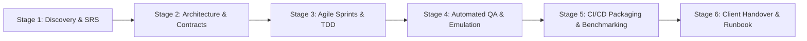

# Kernelwise Labs — SDLC Master Engineering Framework

## 1. Executive Summary & Philosophy
This document establishes the Software Development Life Cycle (SDLC) framework for **Kernelwise Labs**, an engineering agency specializing in:
- **Embedded Linux & Firmware Systems**
- **Android Device Engineering & Telemetry**
- **Smart Devices, IoT & Edge AI**
- **Cloud/DevOps Automation & AI Diagnostic Agents**

Each showcase project is not just a demo; it serves as **hard technical proof** to prospective clients that answers the ultimate question:
> **"Can you solve my problem quickly, reliably, and without breaking my hardware?"**

---

## 2. Five-Engineer Team Structure & Role Matrix

| Role | Primary Lead Focus | Cross-Functional Peer Review Role | Monthly Rotational Hat |
|---|---|---|---|
| **Technical Lead** | Architecture, client interface, board bring-up governance | Reviews AI Diagnostic & Voice Pipelines | Business Development / Proposal Lead |
| **Embedded/Linux Engineer** | Kernel drivers, Yocto, device trees, firmware | Reviews CI/CD and Smart Device Gateways | Lab & Hardware Inventory Admin |
| **AI/Automation Engineer** | RAG root-cause agent, Voice dialog workflows | Reviews Developer Automation CLI & Android logic | Technical Blog & Whitepaper Lead |
| **Cloud/DevOps Engineer** | Docker pipelines, AWS IoT backend, GitHub Actions | Reviews Board Bring-Up & Test Harnesses | Security, Secrets & Infrastructure Admin |
| **Full-Stack/Data Engineer** | Web telemetry dashboards, Matter/BLE UI, REST APIs | Reviews Sensor-to-Cloud & ADB monitors | Client Portal & Invoicing Support |

### Cross-Skill Peer-Review Pairing
To ensure zero single points of failure and prove cross-discipline competence:
- **Project 01 (Android Telemetry):** Built by Full-Stack/Data Eng; Reviewed by Embedded/Linux Eng.
- **Project 02 (ARM Linux Bring-up):** Built by Embedded/Linux Eng; Reviewed by Technical Lead.
- **Project 03 (Embedded CI/CD):** Built by Cloud/DevOps Eng; Reviewed by Embedded/Linux Eng.
- **Project 04 (AI Root-Cause Agent):** Built by AI/Automation Eng; Reviewed by Cloud/DevOps Eng.
- **Project 05 (Voice Agent):** Built by AI/Automation Eng; Reviewed by Full-Stack Eng.
- **Project 06 (IoT Sensor-to-Cloud):** Built by Embedded Eng; Reviewed by Cloud/DevOps Eng.
- **Project 07 (Developer Automation):** Built by Tech Lead; Reviewed by AI/Automation Eng.
- **Project 08 (Smart Device Matter Gateway):** Built by Embedded Eng & Full-Stack Eng; Reviewed by Tech Lead.
- **Project 09 (Smart Edge AI Vision):** Built by AI Eng & Embedded Eng; Reviewed by Tech Lead.

---

## 3. The 6-Stage SDLC Pipeline

Every project in this portfolio adheres strictly to the 6-stage delivery standard:

### Stage 1: Discovery & Requirements Specification (SRS)
- **Problem Statement Definition:** Formulate the explicit high-cost pain point experienced by OEMs and hardware startups.
- **Non-Functional Requirements (NFRs):** Latency bounds (e.g. < 50ms for ADB polling, < 800ms for voice agents), memory constraints (< 16MB for firmware, < 100MB for edge daemon), and platform support (ARM64, Cortex-M, x86_64).

### Stage 2: Architecture & Contract Definition
- **Data Flow & Sequence Diagrams:** Documented in standard Mermaid syntax.
- **API Contracts:** Schema definitions in OpenAPI/JSON-Schema or C header interfaces before writing business logic.
- **Modular Directory Layout:** Clean separation of concerns (drivers, services, API, tests).

### Stage 3: Agile Sprint Implementation
- 2-week timeboxed iterations.
- Modular commit history with descriptive Conventional Commits (`feat:`, `fix:`, `docs:`, `test:`).
- Zero mock dependencies for core math/logic; simulated hardware emulators for cross-platform portability.

### Stage 4: QA, Verification & Emulation
- Unit test coverage target: > 85%.
- Emulation runners: QEMU ARM for kernel/firmware, synthetic ADB bridge for Android, mock MQTT brokers for IoT.
- Memory leak detection (Valgrind / AddressSanitizer for C, memory profilers for Python).

### Stage 5: CI/CD & Automated Verification
- GitHub Actions workflow running on every commit.
- Automated linting, type-checking, cross-compilation, and artifact archiving.
- Benchmark reports generated automatically (binary size, build time, inference speed).

### Stage 6: Client Handover & Video Demonstration
- Engineer-ready `README.md` with 2-minute reproduction instructions.
- Architecture blueprint (`ARCHITECTURE.md`) and Business Abstract (`ABSTRACT.md`).
- Client Runbook detailing production deployment and commercial customization services.

---

## 4. What Every Showcase Repo Must Contain to Win Clients

1. **The "Can You Solve My Problem?" Answer:** Front and center in the `ABSTRACT.md` and `README.md`.
2. **Reproducible Local Execution:** A single command (e.g. `python main.py` or `./build.sh`) boots the working system or interactive simulator immediately.
3. **Hard Metrics:** Real benchmark figures (RAM consumption, CPU overhead, response latency, build time reduction).
4. **Clean Code & Commercial Licensing:** MIT or Apache 2.0 license, clean headers, zero confidential client IP.
