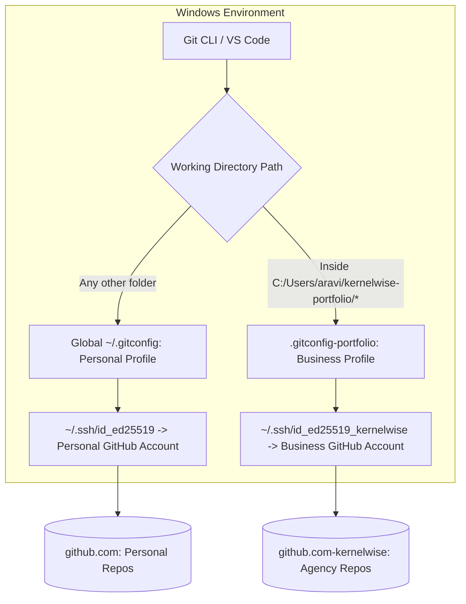

# Multi-Account GitHub Setup Guide for Windows

This guide provides an isolated, professional multi-account Git & GitHub configuration on your Windows machine. It ensures:
1. **Zero credential leakage:** Commits inside `C:\Users\aravi\kernelwise-portfolio\` will always use your agency/business identity (`Kernelwise Labs` / `engineering@kernelwiselabs.com`) without contaminating your personal or day-job Git profile.
2. **Dedicated SSH authentication:** Dedicated SSH keys route exclusively through a dedicated SSH Host alias (`github.com-kernelwise`), preventing accidental pushes using the wrong GitHub account.
3. **Automated Directory-Based Switching:** Powered by Git's native `includeIf` conditional configuration.

---

## Architecture Overview



---

## Step-by-Step Configuration

### Step 1: Create Your New GitHub Account
1. Go to [github.com/signup](https://github.com/signup) in an Incognito / Private window.
2. Register your business account (e.g. `kernelwise-labs` or your dedicated agency username).
3. If using Google Workspace, use `hello@kernelwiselabs.com` or `engineering@kernelwiselabs.com`.

---

### Step 2: Generate Dedicated SSH Keys
Open PowerShell and run:

```powershell
# Create .ssh directory if it does not exist
if (!(Test-Path "$HOME\.ssh")) { New-Item -ItemType Directory -Path "$HOME\.ssh" }

# Generate ED25519 key pair for business GitHub
ssh-keygen -t ed25519 -C "engineering@kernelwiselabs.com" -f "$HOME\.ssh\id_ed25519_kernelwise"
```
*(Press Enter when prompted for a passphrase, or set a secure passphrase).*

---

### Step 3: Add SSH Public Key to Your New GitHub Account
1. Copy the public key to clipboard:
   ```powershell
   Get-Content "$HOME\.ssh\id_ed25519_kernelwise.pub" | Set-Clipboard
   ```
2. In your new GitHub account, navigate to:
   **Settings -> SSH and GPG keys -> New SSH Key**
3. Title: `Windows-Dev-Workstation (Kernelwise)`
4. Key type: `Authentication Key`
5. Paste the key and click **Add SSH key**.

---

### Step 4: Configure `~/.ssh/config`
Edit or create `$HOME\.ssh\config`:

```ssh
# Default / Personal GitHub Account
Host github.com
    HostName github.com
    User git
    IdentityFile ~/.ssh/id_ed25519
    IdentitiesOnly yes

# Business / Agency GitHub Account (Kernelwise Labs)
Host github.com-kernelwise
    HostName github.com
    User git
    IdentityFile ~/.ssh/id_ed25519_kernelwise
    IdentitiesOnly yes
```

Test the connection in PowerShell:
```powershell
ssh -T git@github.com-kernelwise
```
*Expected response: `Hi <your-new-username>! You've successfully authenticated, but GitHub does not provide shell access.`*

---

### Step 5: Configure Automatic Git Identity via `includeIf`

In your global `$HOME\.gitconfig`, add this block at the bottom:

```ini
[includeIf "gitdir:C:/Users/aravi/kernelwise-portfolio/"]
    path = C:/Users/aravi/kernelwise-portfolio/.gitconfig-portfolio
```
*(Note: Forward slashes `/` are required by Git on Windows).*

Inside `C:\Users\aravi\kernelwise-portfolio\.gitconfig-portfolio`, set your business identity:

```ini
[user]
    name = Kernelwise Labs Engineering
    email = engineering@kernelwiselabs.com

[core]
    sshCommand = ssh -i ~/.ssh/id_ed25519_kernelwise -F ~/.ssh/config
```

---

### Step 6: Clone or Link Showcase Repositories

When linking any local project repository to your GitHub remote:

```bash
# Example for Android ADB Telemetry:
cd C:\Users\aravi\kernelwise-portfolio\01-android-adb-telemetry
git remote add origin https://github.com/DAravindReddy/android-adb-telemetry.git
git push -u origin main
```

---

### Step 7: Managing GitHub CLI (`gh`) for Multiple Accounts (Optional)
If you use GitHub CLI:
```bash
# Log in with the account
gh auth login --hostname github.com -p ssh

# Switch between accounts anytime:
gh auth switch --hostname github.com --user DAravindReddy
```

---

## Verification Checklist

| Check | Command | Expected Output |
|---|---|---|
| SSH Auth | `ssh -T git@github.com` | `Hi DAravindReddy! You've successfully authenticated...` |
| Local User Name | `git config user.name` (inside portfolio) | `Kernelwise Labs Engineering` |
| Local User Email | `git config user.email` (inside portfolio) | `engineering@kernelwiselabs.com` |
| Personal Isolation | `git config user.name` (outside portfolio) | Your personal username |
