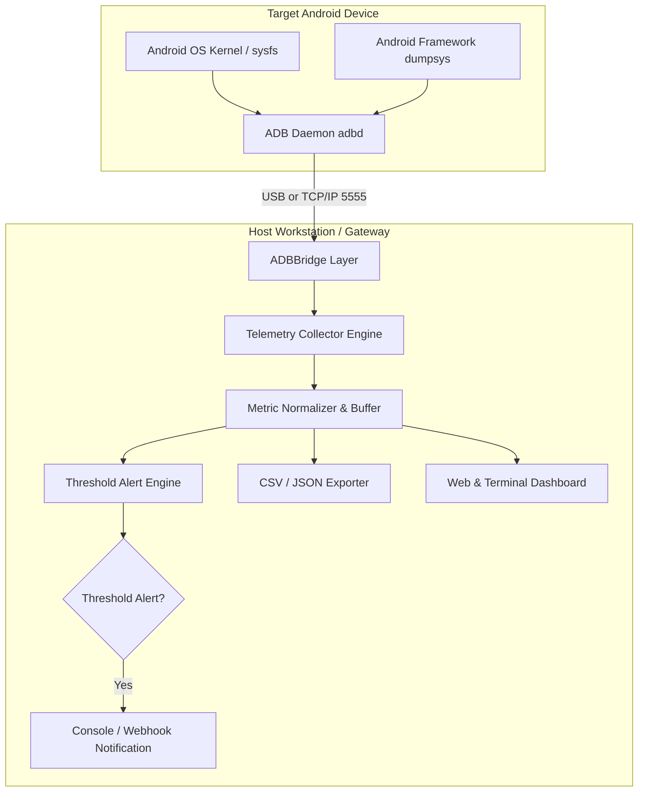

# Project 01: Architecture Specification — Android ADB Telemetry

## 1. System Block Diagram

---

## 2. Component Specifications

### 2.1 ADB Bridge Layer (`src/collector.py`)
- Executes standard Android shell commands:
  - `dumpsys cpuinfo`: Computes total user/kernel load and per-PID percentages.
  - `dumpsys meminfo`: Extracts PSS (Proportional Set Size), Native Heap, Dalvik Heap, and Free RAM.
  - `dumpsys battery`: Reads battery temperature (scaled 0.1°C), charge percentage, voltage.
  - `cat /sys/class/thermal/thermal_zone*/temp`: Queries SoC hardware thermal sensors.
- If no physical device is detected or `--mock` flag is set, seamlessly switches to an internal synthetic emulator generating realistic high-load thermal stress cycles.

### 2.2 Threshold Alert Engine (`src/alert_engine.py`)
- Configurable rules:
  - **Thermal Alert:** > 45°C Warning, > 55°C Critical (thermal throttling risk).
  - **CPU Saturation:** > 85% sustained for > 3 consecutive cycles.
  - **Memory Pressure:** Available RAM < 15% of total system RAM.

### 2.3 Web Dashboard Engine (`src/dashboard.py`)
- Built-in zero-dependency HTTP server with dynamic REST API (`/api/telemetry`) and responsive HTML5 canvas graphs showing real-time CPU, RAM, and Temperature trends.
