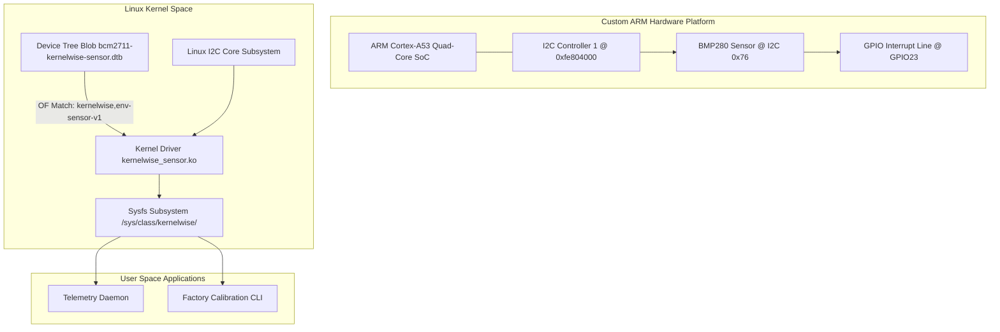

# Project 02: Architecture Specification — Embedded Linux Bring-Up

## 1. Subsystem Architecture Diagram



---

## 2. Hardware to Kernel Driver Contract

### 2.1 Device Tree Node Definition
```dts
&i2c1 {
    status = "okay";
    clock-frequency = <400000>; // 400kHz Fast Mode

    kernelwise_sensor: sensor@76 {
        compatible = "kernelwise,env-sensor-v1";
        reg = <0x76>;
        interrupt-parent = <&gpio>;
        interrupts = <23 2>; // GPIO 23, Falling Edge
        pinctrl-names = "default";
        pinctrl-0 = <&sensor_pins>;
        status = "okay";
    };
};
```

### 2.2 Sysfs ABI Interface
The driver registers under `/sys/class/kernelwise/sensor0/`:
- `temperature_c`: Read-only millidegrees Celsius integer (e.g. `24500` -> 24.50°C).
- `pressure_hpa`: Read-only hectopascal pressure integer (e.g. `101325` -> 1013.25 hPa).
- `sample_rate_hz`: Read/write sampling frequency (1, 10, 50, 100 Hz).
- `calibration_offset`: Read/write temperature trim offset.
