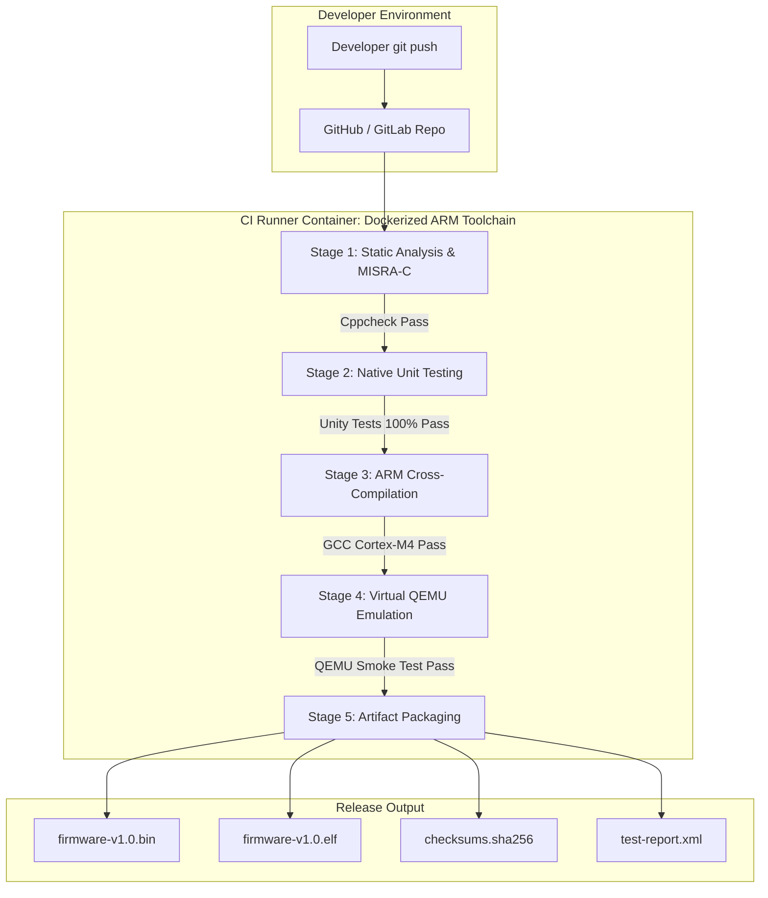

# Project 03: Architecture Specification — Embedded CI/CD Pipeline

## 1. End-to-End Pipeline Workflow

---

## 2. Pipeline Stage Gates & Quality Criteria

| Stage | Tooling | Quality Gate / Exit Condition | Action on Failure |
|---|---|---|---|
| **1. Static Analysis** | Cppcheck 2.10+ | Zero errors, warnings, or style violations | Pipeline halts; prints filename & line number |
| **2. Native Unit Tests** | GCC (Host) + Unity Test | 100% assertions passed; zero memory leaks | Pipeline halts; outputs JUnit test XML |
| **3. Cross-Compilation** | `arm-none-eabi-gcc` 12.3+ | Zero compiler warnings with `-Wall -Wextra -Werror` | Pipeline halts; outputs build diagnostics |
| **4. QEMU Emulation** | `qemu-system-arm` | System boots and emits heartbeat pulse within 5 seconds | Pipeline halts; dumps serial log |
| **5. Artifact Packaging** | Python / SHA256 | Valid `.bin`, `.hex`, `.elf` and generated checksums | Halts release creation |
