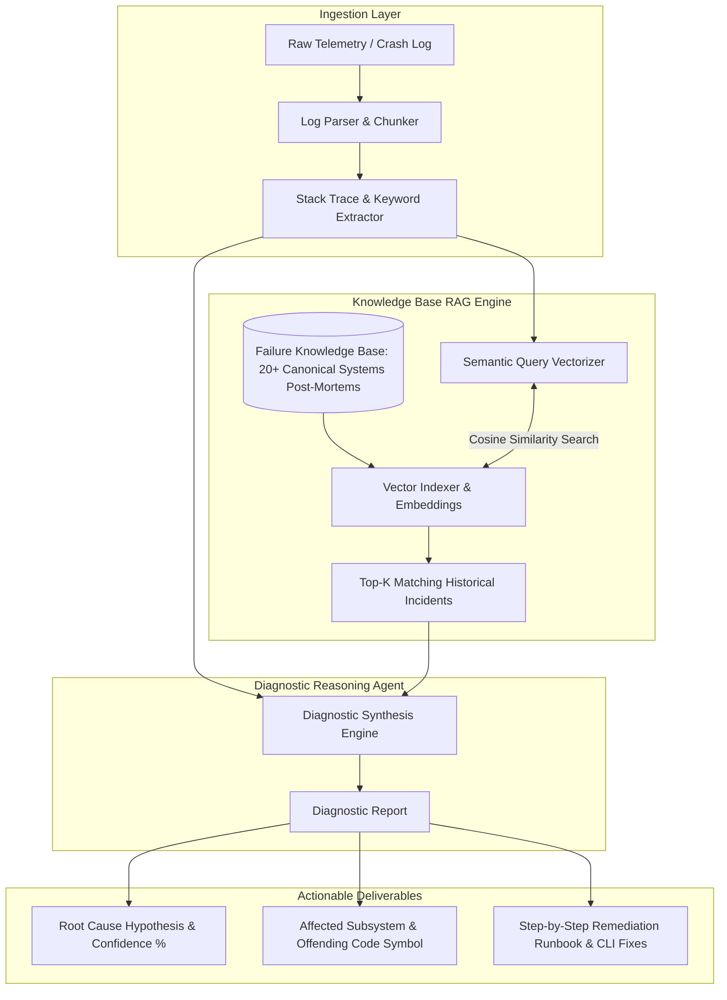

# Project 04: Architecture Specification — AI Root-Cause Diagnostic Agent

## 1. RAG Diagnostic Architecture



---

## 2. Diagnostic Schema Contract

```json
{
  "incident_id": "INC-2026-0842",
  "affected_subsystem": "Linux I2C Bus Driver",
  "root_cause": "I2C SDA line held low by peripheral sensor during clock gating",
  "confidence_score": 0.94,
  "evidence": [
    "[ 142.108] i2c-bcm2835 fe804000.i2c: transfer timed out",
    "[ 142.112] kernelwise_sensor: probe failed with error -110"
  ],
  "matched_kb_reference": "KB-I2C-003: Slave Clock Stretch / SDA Bus Lockup",
  "remediation_runbook": [
    "Run GPIO bus clear sequence: pulse SCL 9 cycles",
    "Configure pinctrl-names = 'default', 'gpio' in device tree for auto bus recovery",
    "Inspect 3.3V pull-up resistor integrity with oscilloscope"
  ]
}
```
