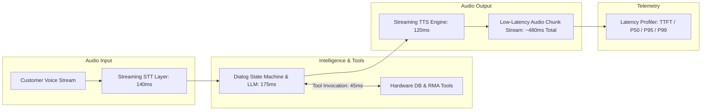

# Project 05: Architecture Specification — Low-Latency Voice Agent

## 1. Streaming Voice Pipeline Architecture

---

## 2. Tool Calling Interfaces (`src/device_tools.py`)

### 2.1 `check_warranty(serial_number: str)`
- Checks warranty status against simulated hardware ERP database.
- Returns status (`ACTIVE`, `EXPIRED`), coverage tier, and registration date.

### 2.2 `trigger_remote_diagnostics(serial_number: str)`
- Simulates an on-device diagnostic query pinging the device.
- Returns current SoC temperature, battery health, and active error codes (e.g. `ERR_OVERHEAT_ZONE1`).

### 2.3 `schedule_rma_repair(serial_number: str, issue: str, slot: str)`
- Enters service ticket into CRM/calendar database and returns confirmation ticket ID.
