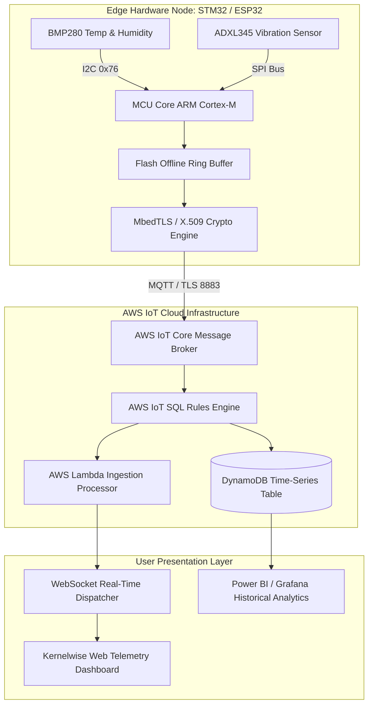

# Project 06: Architecture Specification — IoT Sensor-to-Cloud

## 1. End-to-End System Block Diagram



---

## 2. Telemetry Packet Schema

```json
{
  "device_id": "kw-node-stm32-042",
  "timestamp": 1729004812,
  "telemetry": {
    "temperature_c": 26.85,
    "humidity_pct": 54.2,
    "vibration_g": 0.042,
    "battery_mv": 3280
  },
  "diagnostics": {
    "uptime_seconds": 86420,
    "rssi_dbm": -68,
    "queued_buffer_records": 0
  }
}
```
