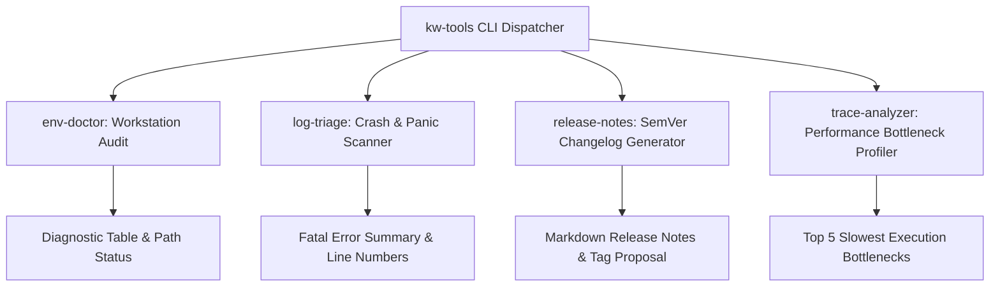

# Project 07: Architecture Specification — Developer Automation Toolkit

## 1. CLI Dispatcher Architecture

---

## 2. Command Interfaces

- `kw-tools env-doctor`: Checks installation status and versions of Git, Python, ADB, GCC, Docker, and QEMU.
- `kw-tools log-triage [--file <path>]`: Analyzes logs from file or pipe, filtering out noise and presenting high-priority failures.
- `kw-tools release-notes [--since <tag>]`: Summarizes git history into categorized `Features`, `Bug Fixes`, and `Documentation`.
- `kw-tools trace-analyzer [--file <path>]`: Computes P50, P95, and maximum execution duration of traced events.
