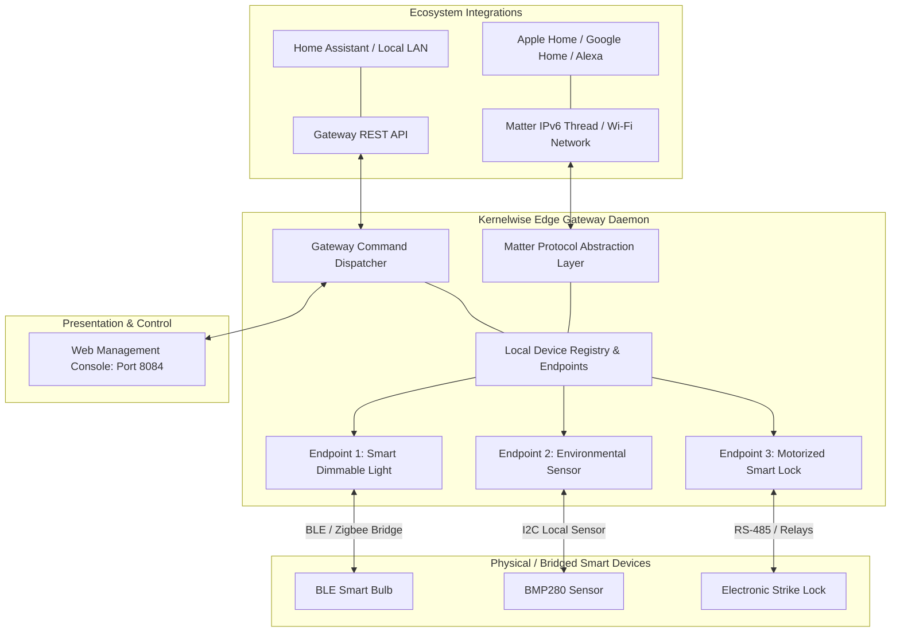

# Project 08: Architecture Specification — Smart Device Matter Gateway

## 1. System Block Diagram

---

## 2. Matter Data Model Cluster Mappings

| Endpoint | Device Type | Cluster ID | Cluster Name | Attributes | Supported Commands |
|---|---|---|---|---|---|
| **0** | Root Node (0x0016) | `0x001D` | Descriptor | DeviceTypeList, ServerList | Query Descriptor |
| **1** | Dimmable Light (0x0101) | `0x0006` | On/Off | `OnOff: bool` | On, Off, Toggle |
| **1** | Dimmable Light (0x0101) | `0x0008` | Level Control | `CurrentLevel: 0-254` | MoveToLevel |
| **2** | Temp Sensor (0x0302) | `0x0402` | Temperature Measurement | `MeasuredValue: s16` | Read Temperature |
| **3** | Door Lock (0x000A) | `0x0101` | Door Lock | `LockState: 1=Locked, 2=Unlocked` | LockDoor, UnlockDoor |
