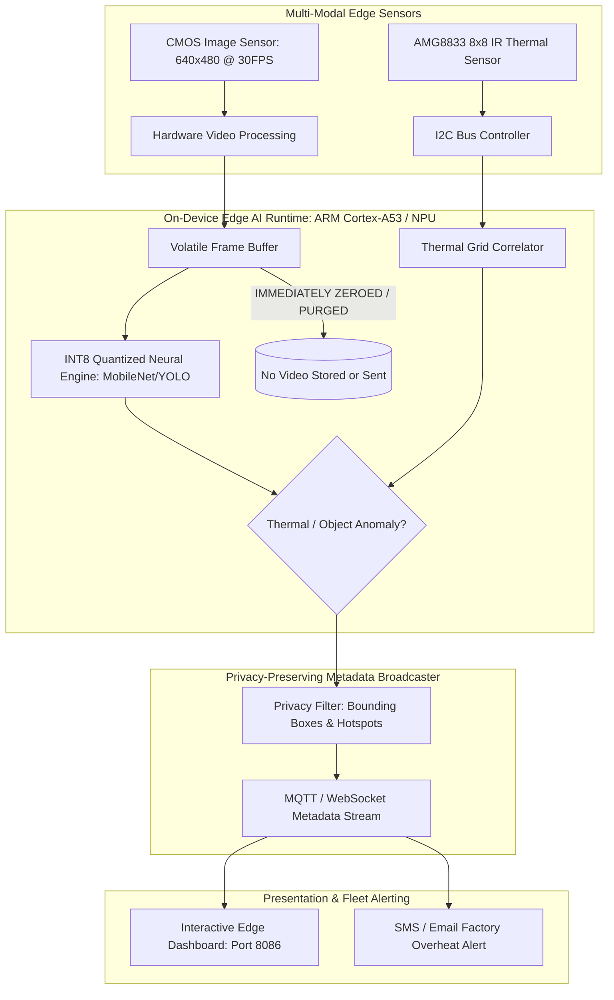

# Project 09: Architecture Specification — Smart Edge AI Vision Appliance

## 1. Edge Inference Pipeline Block Diagram



---

## 2. Privacy-Preserving Metadata Schema

```json
{
  "device_id": "kw-edge-vision-01",
  "timestamp": 1729008920.45,
  "inference_fps": 35.2,
  "inference_latency_ms": 28.4,
  "detections": [
    {
      "class_name": "person",
      "confidence": 0.94,
      "bbox": [120, 45, 280, 410]
    },
    {
      "class_name": "industrial_oven",
      "confidence": 0.89,
      "bbox": [320, 110, 600, 460]
    }
  ],
  "thermal_analysis": {
    "peak_temp_c": 78.4,
    "mean_temp_c": 32.1,
    "hotspot_detected": true,
    "hotspot_location": [450, 210]
  }
}
```
