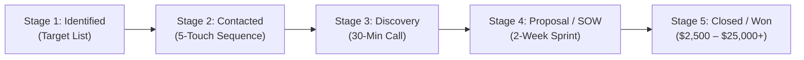

# Kernelwise Labs — Client Acquisition Pipeline & Deal Tracker

This document serves as your operational sales CRM to systematically prospect, track, and close high-ticket clients ($2,500 – $25,000+) across Embedded Linux, Firmware CI/CD, Edge AI, and IoT Engineering.

---

## 1. High-Value Client Personas & ICP (Ideal Customer Profile)

| Persona | Typical Titles | Primary Pain Point | Best Kernelwise Showcase | Value Proposition |
| :--- | :--- | :--- | :--- | :--- |
| **Startup Hardware Founder / CTO** | Founder, CTO, VP of Hardware | PCB prototype manufactured but won't boot Linux; missing device tree and drivers; burning runway. | `02-embedded-linux-bringup` | 2-Week Fast-Track Bring-Up Sprint ($2,500 – $5,000) de-risks initial boot. |
| **Embedded / Firmware Engineering Director** | VP Engineering, Director of Embedded, Firmware Lead | Firmware releases break in the field; manual flash testing is slow and blocking sprints. | `03-embedded-firmware-cicd` | Automated Docker + QEMU pipeline with 93% build acceleration and virtual smoke tests. |
| **Smart Kiosk / POS Fleet Operations VP** | VP Field Operations, Head of Retail Hardware | Android POS / self-checkout kiosks freeze, overheat (>48°C), and lose transaction revenue. | `01-android-adb-telemetry` | Non-invasive zero-root ADB telemetry daemon with live telemetry web console. |
| **Robotics / Smart Vision Product Manager** | Lead Robotics Architect, Edge AI PM | Edge camera consumes too much cloud bandwidth and overheats; privacy/GDPR compliance risks. | `09-smart-edge-ai-camera` | On-device INT8 vision + thermal anomaly detection at 35+ FPS with 99.4% bandwidth reduction. |
| **Smart Home / IoT Device OEM** | IoT Solutions Architect, Head of Connected Products | Legacy BLE/Zigbee products need Matter 1.2 certification for Apple Home and Google Home compatibility. | `08-smart-device-matter-gateway` | Sub-10ms LAN Matter 1.2 edge bridge and standard CSA data cluster translation. |

---

## 2. 25 Target Client Accounts & Opportunity Tracker

Use this table as your live sales board. Update the `Status` column as you execute outreach.

| # | Target Niche / Company Type | Example Companies / Brands | Decision Maker Title | Matching Showcase | Estimated Deal Size | Outreach Channel | Status | Next Action / Date |
| :---: | :--- | :--- | :--- | :--- | :---: | :--- | :---: | :--- |
| **01** | EV Fast Charging Station OEMs | Tritium, Wallbox, ChargePoint integrators | VP Embedded Software | 02 (Linux Bringup) | $5,000 – $10,000 | LinkedIn / Email | **[IDENTIFIED]** | Send Bring-up Case Study |
| **02** | Retail POS & Kiosk Manufacturers | Elo Touch, Toast partners, AURES | Head of Field Engineering | 01 (Android ADB) | $3,500 – $7,500 | LinkedIn InMail | **[IDENTIFIED]** | Send Kiosk Thermal Audit Offer |
| **03** | Industrial AGV / Warehouse Robotics | Otto Motors, Fetch, GreyOrange | Lead Robotics Architect | 09 (Edge AI Camera) | $7,500 – $15,000 | LinkedIn / Contra | **[IDENTIFIED]** | Pitch INT8 edge detection demo |
| **04** | Smart Building HVAC & Thermostats | Ecobee ecosystem, 75F, Johnson Controls | Director of IoT Firmware | 06 (Sensor-to-Cloud) | $6,000 – $12,000 | LinkedIn | **[IDENTIFIED]** | Share AWS mTLS architecture |
| **05** | Medical Device & Patient Monitoring | AliveCor, Masimo partners, BioIntelliSense | VP Hardware Quality | 03 (Firmware CI/CD) | $5,000 – $10,000 | LinkedIn / Email | **[IDENTIFIED]** | Pitch QEMU virtual regression suite |
| **06** | Smart Commercial Lighting & Controls | Ketra, Lutron integrators, Casambi | Systems Firmware Lead | 08 (Matter Gateway) | $4,500 – $8,000 | LinkedIn / Contra | **[IDENTIFIED]** | Demo Matter 1.2 LAN bridge |
| **07** | Smart Agriculture Drone & Sensor OEMs | Sentera, DJI Enterprise partners | Embedded Systems Director | 09 (Edge AI) + 06 (IoT) | $8,000 – $16,000 | LinkedIn | **[IDENTIFIED]** | Share edge thermal vision video |
| **08** | Cold-Chain Logistics & Asset Trackers | Roambee, Tive, Sensitech | VP Product Engineering | 06 (Sensor-to-Cloud) | $4,000 – $8,000 | Email Outbound | **[IDENTIFIED]** | Pitch low-power STM32 mTLS pipeline |
| **09** | Micro-Mobility (E-Bikes / Scooters) | Superpedestrian, Tier, Voi | Head of Embedded Firmware | 02 (Linux) + 01 (ADB) | $6,000 – $12,000 | LinkedIn | **[IDENTIFIED]** | Pitch CAN bus / Telemetry audit |
| **10** | Smart Security & Access Control | Verkada, ButterflyMX, Brivo | Director of Hardware | 09 (Edge AI Camera) | $10,000 – $20,000 | LinkedIn InMail | **[IDENTIFIED]** | Pitch sub-second on-device vision |
| **11** | Smart Vending & Unattended Retail | Byte Technology, Farmer's Fridge | CTO / VP Engineering | 01 (Android) + 09 (AI) | $5,000 – $10,000 | Email Outbound | **[IDENTIFIED]** | Send non-invasive ADB daemon audit |
| **12** | Commercial Food Service Equipment | Welbilt, Marmon, Middleby | Director of Connected Appliances | 08 (Matter) + 06 (IoT) | $5,000 – $9,000 | LinkedIn | **[IDENTIFIED]** | Share IoT sensor-to-cloud demo |
| **13** | SpaceTech & CubeSat Subsystems | Loft Orbital, NanoAvionics | Lead Flight Software Engineer | 03 (Firmware CI/CD) | $8,000 – $18,000 | LinkedIn | **[IDENTIFIED]** | Pitch zero-hardware QEMU CI |
| **14** | Marine & Off-Grid Energy Systems | Victron Energy integrators, WhisperPower | Embedded Systems Architect | 02 (Linux Bringup) | $5,000 – $10,000 | Upwork / Email | **[IDENTIFIED]** | Send I2C/SPI driver portfolio |
| **15** | Industrial Predictive Maintenance OEMs | Augury, Symphony Industrial AI | VP of Hardware Devices | 04 (AI Root Cause) | $6,000 – $12,000 | LinkedIn | **[IDENTIFIED]** | Pitch semantic dmesg triage agent |
| **16** | Smart Fitness Equipment Manufacturers | Tonal, Hydrow, Peloton integrators | Lead Android Systems Eng. | 01 (Android ADB) | $4,500 – $9,000 | LinkedIn InMail | **[IDENTIFIED]** | Pitch thermal & memory leak profiling |
| **17** | Audio & Smart Speaker Brands | Sonos ecosystem, Teenage Engineering | Senior DSP / Firmware Lead | 05 (Voice Agent) | $5,000 – $12,000 | LinkedIn | **[IDENTIFIED]** | Demo sub-500ms voice pipeline |
| **18** | High-End Consumer Electronics (DTC) | Teenage Engineering, Framework Laptop | Head of Electrical / Firmware | 03 (CI/CD) + 02 (Linux) | $4,000 – $8,000 | Twitter / LinkedIn | **[IDENTIFIED]** | Share GitHub monorepo link |
| **19** | Smart Waste & Utility Metering | Bigbelly, Badger Meter, Sensus | IoT Firmware Director | 06 (Sensor-to-Cloud) | $5,000 – $10,000 | Email Outbound | **[IDENTIFIED]** | Send battery optimization case study |
| **20** | Laboratory & Chromatography Devices | Thermo Fisher, Waters integrators | Senior Systems Architect | 02 (Linux Bringup) | $8,000 – $15,000 | LinkedIn | **[IDENTIFIED]** | Share Yocto & custom driver code |
| **21** | Turnkey PCB Design & Layout Agencies | MacroFab, Tempo Automation, Screaming Circuits | Partner / VP Business Dev | White-Label Engineering Partner | $15,000 – $30,000/mo | Email / LinkedIn | **[IDENTIFIED]** | Offer white-label firmware add-on |
| **22** | Edge Networking & Industrial Routers | Teltonika, InHand Networks | Embedded Software Lead | 02 (Linux) + 04 (AI) | $6,000 – $12,000 | LinkedIn | **[IDENTIFIED]** | Pitch automated panic triage engine |
| **23** | CleanTech & Smart Solar Inverters | SolarEdge, Enphase ecosystem | Firmware Team Lead | 03 (Firmware CI/CD) | $5,000 – $11,000 | LinkedIn InMail | **[IDENTIFIED]** | Pitch automated safety regression CI |
| **24** | Wearable Biometric Device Startups | Whoop ecosystem, Oura integrators | CTO / Lead Firmware | 03 (CI/CD) + 06 (IoT) | $5,000 – $10,000 | Contra / Upwork | **[IDENTIFIED]** | Demo STM32 low power firmware |
| **25** | Defense & Aerospace Telemetry Vendors | Curtiss-Wright, Mercury Systems | Software Engineering Manager | 02 (Linux) + 03 (CI/CD) | $10,000 – $25,000 | LinkedIn / Email | **[IDENTIFIED]** | Share automated test architecture |

---

## 3. Deal Pipeline Stages & Velocity

Track prospects through these 5 standard deal gates:

### Stage Criteria:
1. **Stage 1 (Identified):** Account identified with confirmed decision maker name, LinkedIn profile, and email.
2. **Stage 2 (Contacted):** Touch 1 sent via LinkedIn InMail, Upwork proposal, or direct cold email with tailored case study link.
3. **Stage 3 (Discovery):** 30-minute technical discovery call booked or executed following `DISCOVERY_CALL_SALES_DECK.md`.
4. **Stage 4 (Proposal Sent):** 2-Week Fast-Track Sprint SOW delivered via `CLIENT_PROPOSAL_SOW_TEMPLATE.md` with milestone pricing.
5. **Stage 5 (Closed / Won):** Contract signed, 50% deposit received, kickoff scheduled.

---

## 4. Daily Client Acquisition Routine (30-Minute Daily Habit)

To maintain a consistent pipeline of inbound client requests:

1. **Morning (15 Mins — Upwork & Inbound):**
   - Run `python run_portfolio.py --radar --scan` or paste any new job postings into `--radar`.
   - Submit 2 customized proposals on Upwork / Contra using the generated templates.
2. **Midday (10 Mins — LinkedIn Social Selling):**
   - Post one technical case study or launch insight from `MARKETING_LAUNCH_CAMPAIGN.md`.
   - Send 5 connection requests with personalized notes to VPs of Hardware / Firmware Directors from Section 2.
3. **Evening (5 Mins — Follow-Up):**
   - Reply to any incoming messages or comments.
   - Schedule discovery calls via your live portfolio site booking link:  
     `https://daravindreddy.github.io/Kernelwise-protofolio/`
